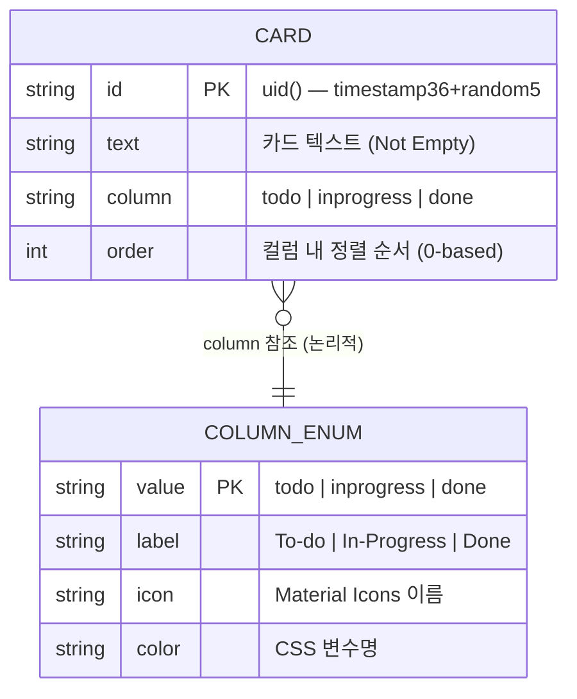
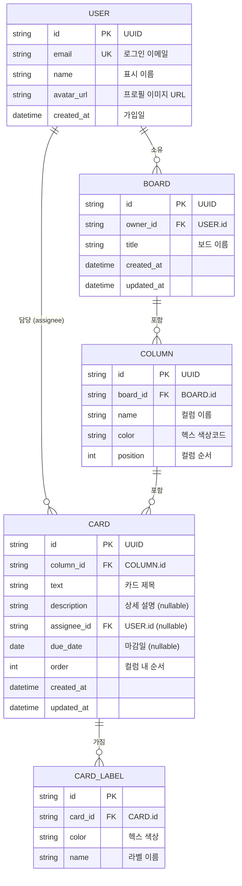

# DATABASE_DESIGN — 데이터베이스 설계

> 현재 버전은 백엔드 DB 없이 브라우저 `localStorage`를 저장소로 사용한다.
> 아래 ERD는 현재 데이터 모델과 추후 서버 연동 시 확장 설계를 모두 포함한다.

---

## 1. 현재 데이터 모델 (localStorage)

### 1.1 저장 구조

```
localStorage Key: 'kanban-cards'
localStorage Value: JSON 직렬화된 Card 배열
```

### 1.2 Card 엔티티

| 필드 | 타입 | 제약 | 설명 |
|---|---|---|---|
| `id` | string | PK, Unique | `Date.now().toString(36) + random5` |
| `text` | string | Not Null, Not Empty | 카드 텍스트 내용 |
| `column` | string | Enum | `'todo'` \| `'inprogress'` \| `'done'` |
| `order` | number | Not Null, ≥0 | 컬럼 내 정렬 순서 (0-based 정수) |

### 1.3 예시 데이터

```json
[
  { "id": "lz1r4kab2c", "text": "프로젝트 기획서 작성", "column": "todo",       "order": 0 },
  { "id": "lz1r4kxd3e", "text": "UI 디자인 검토",       "column": "todo",       "order": 1 },
  { "id": "lz1r4kfe4f", "text": "백엔드 API 개발",      "column": "inprogress", "order": 0 },
  { "id": "lz1r4khg5g", "text": "환경 설정 완료",       "column": "done",       "order": 0 }
]
```

---

## 2. 현재 모델 ERD



> `COLUMN_ENUM`은 실제 저장 엔티티가 아닌 논리적 열거형이다.
> `app.js`의 `COLUMNS` 배열과 `style.css`의 `[data-column]` 선택자가 이를 구현한다.

---

## 3. 확장 설계 (서버 연동 시 — v2 계획)

서버 백엔드와 다중 사용자를 지원할 경우 아래 스키마를 기준으로 확장한다.



---

## 4. 마이그레이션 경로

현재 localStorage → 서버 DB 전환 시 변환 규칙:

| 현재 (localStorage) | v2 (서버 DB) | 비고 |
|---|---|---|
| `card.id` (uid) | `card.id` (UUID) | 신규 UUID 발급 |
| `card.column` (enum 문자열) | `card.column_id` (FK) | 컬럼 레코드 생성 후 매핑 |
| `card.order` | `card.order` | 동일 |
| `card.text` | `card.text` | 동일 |
| — | `card.description` | 기본값 null |
| — | `card.assignee_id` | 기본값 null |
| — | `card.due_date` | 기본값 null |
