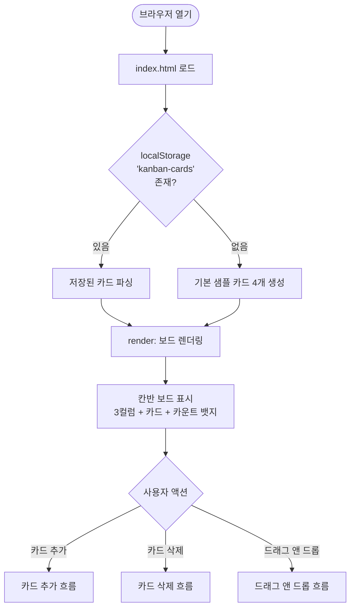
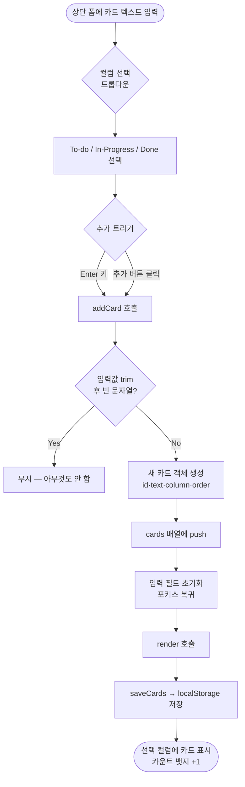
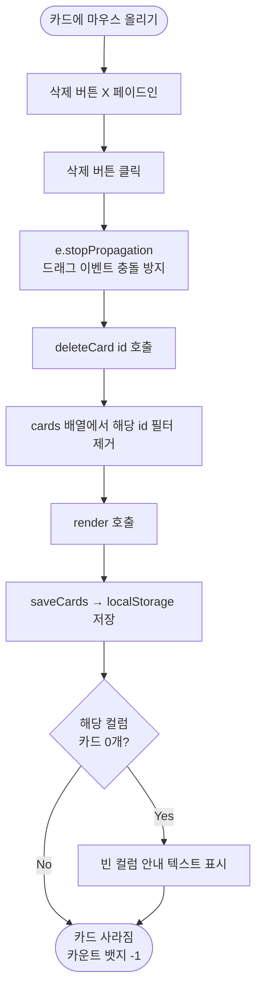
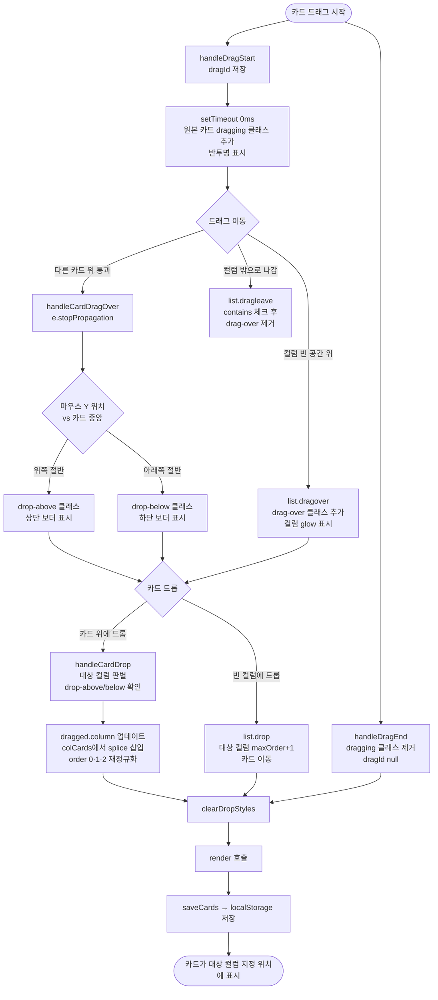
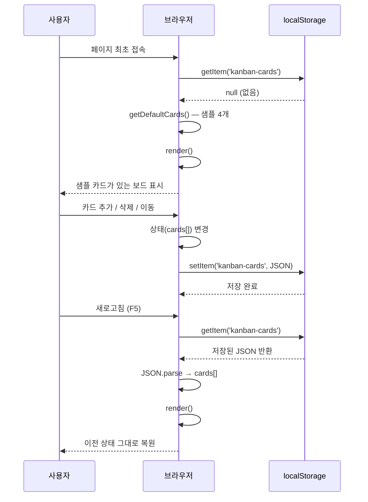

# USER_FLOW — 사용자 흐름도

## 1. 전체 앱 흐름

```mermaid
flowchart TD
    A([브라우저 열기]) --> B[index.html 로드]
    B --> C{localStorage\n'kanban-cards'\n존재?}
    C -- 있음 --> D[저장된 카드 파싱]
    C -- 없음 --> E[기본 샘플 카드 4개 생성]
    D --> F[render: 보드 렌더링]
    E --> F
    F --> G[칸반 보드 표시\n3컬럼 + 카드 + 카운트 뱃지]

    G --> H{사용자 액션}
    H -- 카드 추가 --> I[카드 추가 흐름]
    H -- 카드 삭제 --> J[카드 삭제 흐름]
    H -- 드래그 앤 드롭 --> K[드래그 앤 드롭 흐름]
```

---

## 2. 카드 추가 흐름

```mermaid
flowchart TD
    A([상단 폼에 카드 텍스트 입력]) --> B{컬럼 선택\n드롭다운}
    B --> C[To-do / In-Progress / Done 선택]
    C --> D{추가 트리거}
    D -- Enter 키 --> E[addCard 호출]
    D -- 추가 버튼 클릭 --> E

    E --> F{입력값 trim\n후 빈 문자열?}
    F -- Yes --> G[무시 — 아무것도 안 함]
    F -- No --> H[새 카드 객체 생성\nid·text·column·order]
    H --> I[cards 배열에 push]
    I --> J[입력 필드 초기화\n포커스 복귀]
    J --> K[render 호출]
    K --> L[saveCards → localStorage 저장]
    L --> M([선택 컬럼에 카드 표시\n카운트 뱃지 +1])
```

---

## 3. 카드 삭제 흐름

```mermaid
flowchart TD
    A([카드에 마우스 올리기]) --> B[삭제 버튼 X 페이드인]
    B --> C[삭제 버튼 클릭]
    C --> D[e.stopPropagation\n드래그 이벤트 충돌 방지]
    D --> E[deleteCard id 호출]
    E --> F[cards 배열에서 해당 id 필터 제거]
    F --> G[render 호출]
    G --> H[saveCards → localStorage 저장]
    H --> I{해당 컬럼\n카드 0개?}
    I -- Yes --> J[빈 컬럼 안내 텍스트 표시]
    I -- No --> K([카드 사라짐\n카운트 뱃지 -1])
    J --> K
```

---

## 4. 드래그 앤 드롭 흐름

```mermaid
flowchart TD
    A([카드 드래그 시작]) --> B[handleDragStart\ndragId 저장]
    B --> C[setTimeout 0ms\n원본 카드 dragging 클래스 추가\n반투명 표시]

    C --> D{드래그 이동}

    D -- 다른 카드 위 통과 --> E[handleCardDragOver\ne.stopPropagation]
    E --> F{마우스 Y 위치\nvs 카드 중앙}
    F -- 위쪽 절반 --> G[drop-above 클래스\n상단 보더 표시]
    F -- 아래쪽 절반 --> H[drop-below 클래스\n하단 보더 표시]

    D -- 컬럼 빈 공간 위 --> I[list.dragover\ndrag-over 클래스 추가\n컬럼 glow 표시]

    D -- 컬럼 밖으로 나감 --> J[list.dragleave\ncontains 체크 후\ndrag-over 제거]

    G --> K{카드 드롭}
    H --> K
    I --> K

    K -- 카드 위에 드롭 --> L[handleCardDrop\n대상 컬럼 판별\ndrop-above/below 확인]
    L --> M[dragged.column 업데이트\ncolCards에서 splice 삽입\norder 0·1·2 재정규화]

    K -- 빈 컬럼에 드롭 --> N[list.drop\n대상 컬럼 maxOrder+1\n카드 이동]

    M --> O[clearDropStyles]
    N --> O
    O --> P[render 호출]
    P --> Q[saveCards → localStorage 저장]
    Q --> R([카드가 대상 컬럼 지정 위치에 표시])

    A --> S[handleDragEnd\ndragging 클래스 제거\ndragId null]
    S --> O
```

---

## 5. 상태 지속성 흐름

```mermaid
sequenceDiagram
    participant U as 사용자
    participant B as 브라우저
    participant LS as localStorage

    U->>B: 페이지 최초 접속
    B->>LS: getItem('kanban-cards')
    LS-->>B: null (없음)
    B->>B: getDefaultCards() — 샘플 4개
    B->>B: render()
    B-->>U: 샘플 카드가 있는 보드 표시

    U->>B: 카드 추가 / 삭제 / 이동
    B->>B: 상태(cards[]) 변경
    B->>LS: setItem('kanban-cards', JSON)
    LS-->>B: 저장 완료

    U->>B: 새로고침 (F5)
    B->>LS: getItem('kanban-cards')
    LS-->>B: 저장된 JSON 반환
    B->>B: JSON.parse → cards[]
    B->>B: render()
    B-->>U: 이전 상태 그대로 복원
```
